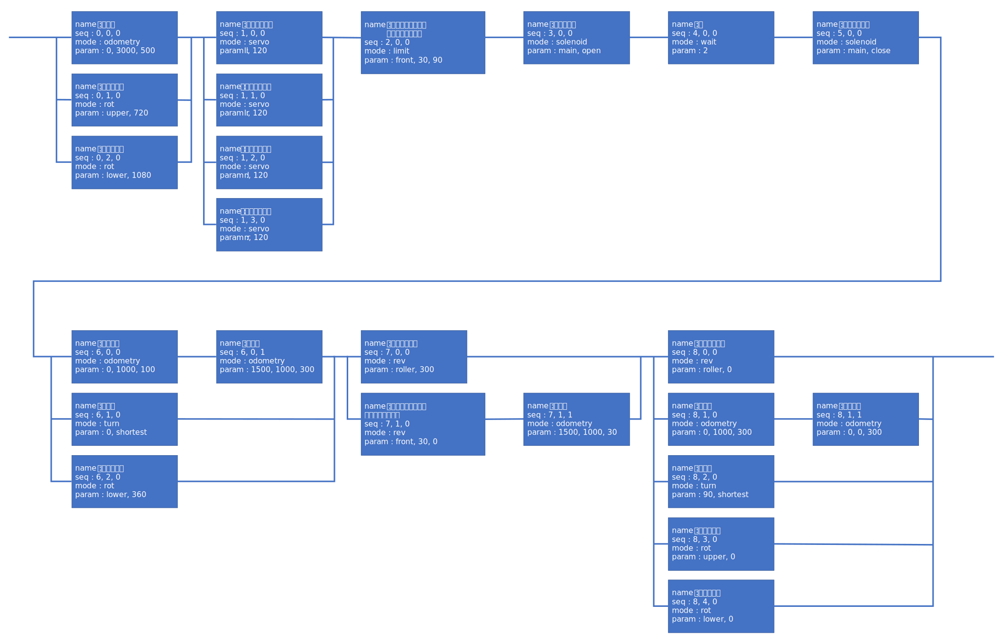

# jibiki::ProcOperateAuto orders 詳細
[戻る](quick_proc_operate_auto.md/#jibikiProcOperateAuto)

# orders（図で表現）


# orders（JSON ファイルで表現）
上図の `orders` を JSON ファイルで表現すると次のようになる．
```JSON
{
    "test": [
        {
            "name": "前に移動",
            "seq": [0, 0, 0],
            "mode": "odometry",
            "param": [0, 3000, 500]
        },
        {
            "name": "昇降を動かす",
            "seq": [0, 1, 0],
            "mode": "rot",
            "param": ["upper", 720]
        },
        {
            "name": "昇降を動かす",
            "seq": [0, 2, 0],
            "mode": "rot",
            "param": ["lower", 1080]
        },
        {
            "name": "サーボを動かす",
            "seq": [1, 0, 0],
            "mode": "servo",
            "param": ["ll", 120]
        },
        {
            "name": "サーボを動かす",
            "seq": [1, 1, 0],
            "mode": "servo",
            "param": ["lr", 120]
        },
        {
            "name": "サーボを動かす",
            "seq": [1, 2, 0],
            "mode": "servo",
            "param": ["rl", 120]
        },
        {
            "name": "サーボを動かす",
            "seq": [1, 3, 0],
            "mode": "servo",
            "param": ["rr", 120]
        },
        {
            "name": "リミットスイッチが押されるまで移動",
            "seq": [2, 0, 0],
            "mode": "limit",
            "param": ["front", 30, 90]
        },
        {
            "name": "電磁弁を開く",
            "seq": [3, 0, 0],
            "mode": "solenoid",
            "param": ["main", "open"]
        },
        {
            "name": "待機",
            "seq": [4, 0, 0],
            "mode": "wait",
            "param": ["2"]
        },
        {
            "name": "電磁弁を閉じる",
            "seq": [5, 0, 0],
            "mode": "solenoid",
            "param": ["main", "close"]
        },
        {
            "name": "後ろに移動",
            "seq": [6, 0, 0],
            "mode": "odometry",
            "param": [0, 1000, 100]
        },
        {
            "name": "右に移動",
            "seq": [6, 0, 1],
            "mode": "odometry",
            "param": [1500, 1000, 300]
        },
        {
            "name": "回転する",
            "seq": [6, 1, 0],
            "mode": "turn",
            "param": [0, "shortest"]
        },
        {
            "name": "昇降を動かす",
            "seq": [6, 2, 0],
            "mode": "rot",
            "param": ["lower", 360]
        },
        {
            "name": "ローラーを回転",
            "seq": [7, 0, 0],
            "mode": "rev",
            "param": ["roller", 300]
        },
        {
            "name": "リミットスイッチが押されるまで移動",
            "seq": [7, 1, 0],
            "mode": "rev",
            "param": ["front", 30, 0]
        },
        {
            "name": "左へ移動",
            "seq": [7, 1, 1],
            "mode": "odometry",
            "param": [1500, 1000, 30]
        },
        {
            "name": "ローラーを停止",
            "seq": [8, 0, 0],
            "mode": "rev",
            "param": ["roller", 0]
        },
        {
            "name": "左へ移動",
            "seq": [8, 1, 0],
            "mode": "odometry",
            "param": [0, 1000, 300]
        },
        {
            "name": "後ろへ移動",
            "seq": [8, 1, 1],
            "mode": "odometry",
            "param": [0, 0, 300]
        },
        {
            "name": "回転する",
            "seq": [8, 2, 0],
            "mode": "turn",
            "param": [90, "shortest"]
        },
        {
            "name": "昇降を動かす",
            "seq": [8, 3, 0],
            "mode": "rot",
            "param": ["upper", 0]
        },
        {
            "name": "昇降を動かす",
            "seq": [8, 4, 0],
            "mode": "rot",
            "param": ["lower", 0]
        }
    ]
}
```

# mode_list
[上記](#ordersJSON-ファイルで表現)の `orders` の場合の `mode_list` は次のようになる．
```JSON
{
    "mode_list": [
        "odometry",
        "turn",
        "limit",
        "rot",
        "rev",
        "servo",
        "solenoid",
        "wait"
    ]
}
```